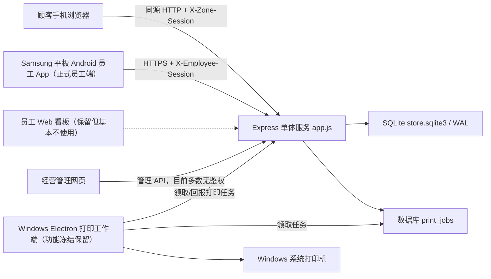
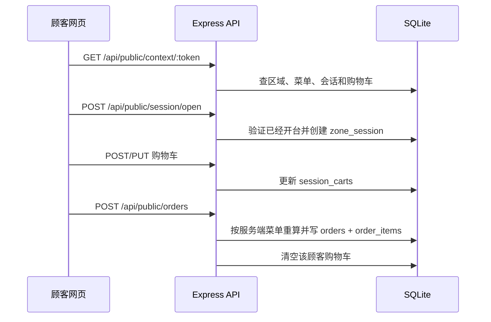

# 02 整体架构与目录结构

## 1. 架构总览



代码仓库是“后端单体 + 多种客户端”的结构，但实际员工操作模式不是多端并行：正式员工交互端只有 Samsung 平板 Android App。员工 Web 不投入现场使用；Windows Electron 不再更新员工交互能力，但作为后台小票打印工作端继续运行。所有核心业务规则、数据库表和 API 仍集中在根目录 `app.js`。

## 2. 运行组件

### 2.1 Express 服务

根文件 `app.js` 同时负责：

- 读取 `.env`；
- 打开并初始化 SQLite；
- 执行兼容旧数据的字段补丁和 JSON 迁移；
- 提供静态页面；
- 提供 63 条路由符号，其中包括页面路由和 API 路由；
- 执行顾客/员工会话验证；
- 处理菜单、购物车、订单、结账、历史和打印任务；
- 串行调度 API 写请求；
- 设置基础安全响应头。

`app.js` 是当前系统的真正业务核心，也形成了明显的单文件集中风险：修改一处可能同时影响初始化、数据模型、API 和业务流程。

### 2.2 SQLite 持久化

默认数据库文件为 `database/store.sqlite3`，运行时启用：

- `journal_mode = WAL`；
- `foreign_keys = ON`；
- 可配置的 `busy_timeout`。

SQLite 保存菜单、区域、订单、历史、顾客/员工会话、结算标记和打印任务。`database/store.json` 是旧版数据格式，只在 SQLite 尚无业务数据时用于一次性迁移，不是当前主要数据库。

### 2.3 进程内写入队列

所有 `/api` 下的 `POST`、`PUT`、`PATCH`、`DELETE` 请求经过 FIFO 队列。当前请求完全结束后才处理下一条写请求，目的是减少 SQLite 写锁冲突。

重要边界：这个队列只存在于当前 Node 进程内。若同时运行多个 Node 实例，每个实例都有自己的队列，不能提供跨实例互斥。

### 2.4 顾客网页

`front_user/` 是手机优先的无构建静态页面。它通过 URL token 确定包厢，通过浏览器本地存储保存顾客会话 token，并轮询菜单/上下文、购物车和订单。

### 2.5 员工 Web 看板

`front_admin/` 是仓库中保留的员工接单页，但现场基本不使用。它不属于 Samsung Android UI 重构范围，也不能作为 Android 功能或视觉验收替代品。

### 2.6 经营管理页

`admin_manage/` 管理菜单分类、菜单项、包厢二维码、员工和日结报表。它是经营配置页面，不是员工接单页面。本次只重构页面组织；Access Code 展示和轮换入口是唯一明确退役的既有管理端能力。

### 2.7 React Native 员工 App

`apps/employee_app/` 是正式员工客户端，目标设备为 Samsung 安卓平板，横屏优先。项目使用 React Native 0.85.3，Android 和 iOS 技术上共用 `App.tsx`，但本轮产品设计、运行和验收只针对 Android。它直接请求固定的生产地址，约每秒轮询员工 API。

### 2.8 Windows Electron 员工端

`windows_employee_app/` 使用 Electron 22.3.27，以兼容 Windows 7/8/8.1 为目标。它不再作为员工接单/结算界面继续更新，但现有打印工作端必须保留：在后台领取服务端打印任务、枚举打印机、打印并回报成功或失败。渲染进程通过 preload 暴露的窄 IPC 接口请求主进程完成：

- 服务端 HTTP/HTTPS 请求；
- 本地配置读写；
- 打印机枚举；
- 小票打印；
- 打开外部网页。

## 3. 目录职责

```text
order_system/
├── app.js                       # 后端、数据库初始化、全部业务 API
├── package.json                 # 根服务依赖和启动命令
├── .env*.example               # 本地/AWS 配置模板
├── ENV_SETUP.md                 # 旧版环境说明
├── database/
│   ├── store.json               # 旧版 JSON 数据迁移来源
│   └── store.sqlite3            # 运行时生成，Git 忽略
├── front_user/                  # 顾客扫码点单网页
├── front_admin/                 # 员工 Web 接单看板
├── admin_manage/                # 经营管理网页
├── style/main.css               # 三个 Web 页面共享样式
├── apps/employee_app/           # React Native 员工移动端
├── windows_employee_app/        # Electron Windows 员工端及构建产物
├── *.mp3                        # 新单/外卖提示音素材
└── docs/                        # 本次建立的项目说明分册
```

## 4. 关键数据流

### 4.1 顾客点单数据流



### 4.2 员工处理与结单数据流

```mermaid
sequenceDiagram
    participant Staff as 员工端
    participant API as Express API
    participant DB as SQLite
    Staff->>API: 登录并获取员工 session
    Staff->>API: 开台 / 拉取订单与包厢
    API->>DB: 更新 session 状态并读取活动订单
    Staff->>API: 更新订单、菜品、结算标记
    API->>DB: 更新 orders/order_items/settlements
    Staff->>API: 请求打印小票
    API->>DB: 新建 print_jobs
    Staff->>API: 结单
    API->>DB: 活动订单归档，清理会话与购物车
```



## 5. 架构取舍

当前设计的优点：

- 依赖少，部署和故障定位简单；
- 前后端同源，不需要复杂 CORS；
- SQLite 事务适合单实例、低运维单店；
- 同一 API 可服务 Web、移动端和 Windows；
- 打印任务落库，服务端与门店打印机解耦。

当前设计的代价：

- 单个 `app.js` 超过 3500 行，职责过于集中；
- 多个客户端复制了相似的状态和渲染逻辑；
- 轮询频率高，缺少 WebSocket/SSE；
- 进程内写队列限制水平扩展；
- 管理接口鉴权不完整；
- 代码内常量绑定具体场所、税率、服务费率和生产域名。
