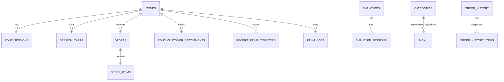

# 05 数据库与数据模型

## 1. 数据库运行方式

默认数据库：`database/store.sqlite3`。

服务启动时会自动：

1. 创建数据库目录。
2. 打开 SQLite。
3. 启用 WAL、外键和 busy timeout。
4. 执行全部 `CREATE TABLE IF NOT EXISTS`。
5. 对旧表缺失字段执行 `ALTER TABLE` 补丁。
6. 必要时从 `database/store.json` 迁移。
7. 填充空数据库的默认数据。

当前没有独立的、带版本号的 migration 文件。数据库演进逻辑直接写在 `app.js` 中，因此部署新版本前必须备份数据库并验证启动升级。

## 2. 实体关系



分类与菜单通过分类名称逻辑关联，不是外键。历史订单与历史明细也没有声明外键，以便独立保存快照。

## 3. 表说明

### 3.1 `settings`

键值设置表：

| 字段 | 含义 |
| --- | --- |
| `key` | 设置键，主键 |
| `value` | 字符串值 |
| `updated_at` | 更新时间 |

既保存场所名称/电话等业务配置，也保存区域会话内部状态：

- 会话周期开始时间；
- 当前结算模式；
- 是否开台。

这类动态状态没有单独建表，而是通过带区域 ID 的动态 key 保存。

### 3.2 `categories`

菜单分类：ID、唯一名称、排序值和创建时间。

### 3.3 `menu`

菜单主数据：

- `id`：稳定标识；
- `name`、`description`、`category`；
- `price`：SQLite `REAL`；
- `sort_index`；
- `available`：0/1；
- 创建/更新时间。

货币以 `REAL` 保存，业务计算时会转成整数分再运算，但数据库层本身不是整数分模型。

### 3.4 `zones`

桌台/包厢：

- 唯一标签；
- 唯一二维码 token；
- 已退役的 Access Code 及更新时间兼容字段：`access_code`、`access_code_updated_at`；
- 完成标记；
- 创建时间。

代码没有独立的 `zone_type` 或门店字段，桌台与包厢主要通过标签展示。

Access Code 字段是真实 SQLite schema 的一部分，当前初始化、兼容补丁和部分后端函数仍会读写它们。本次 UI 重构必须保留字段、SQL 和数据原样；目标前端不展示、不发送、不校验、不轮换。未来物理删除只能作为独立数据库/后端任务。

### 3.5 `carts`

旧版区域级购物车，每个区域一条。当前主要流程已经转向 `session_carts`，此表主要为兼容旧数据存在。

### 3.6 `session_carts`

顾客会话级购物车，复合主键为：

```text
(zone_id, zone_session_id)
```

`items_json` 保存 `{menuId: quantity}`，`note` 保存该顾客备注。`zone_session_id` 字段名称上表示 session，但没有声明到 `zone_sessions.id` 的外键，只对 `zone_id` 有外键。

### 3.7 `orders`

活动订单头：

- 区域 ID、标签和 token 快照；
- 顾客姓名；
- 备注；
- 总额；
- 状态；
- 最后处理员工 ID/用户名；
- 创建和更新时间。

服务端读取订单时会根据明细重新计算总额，因此响应中的 `total` 不完全依赖表中缓存值。

### 3.8 `order_items`

活动订单明细：菜单 ID、名称、单价、数量、小计和是否送达。名称和价格是下单时快照，之后修改菜单不会反向修改现有订单。

### 3.9 `order_history`

结单后的订单头快照，额外保存：

- `archived_at`：归档时间；
- `checkout_at`：结单时间。

历史表没有到 `zones` 的外键，区域以后删除也不会因为外键自动破坏历史快照。

### 3.10 `order_history_items`

归档明细快照。结单事务从活动明细复制后删除原明细。

### 3.11 `zone_sessions`

顾客授权会话：

- 区域 ID；
- 唯一随机 session token；
- 顾客姓名；
- 创建、最后访问和到期时间；
- 可空的撤销时间。

每个有效请求都会更新最后访问时间并把到期时间向后延长。

### 3.12 `employees`

员工账号：唯一用户名、显示名、密码哈希、启用状态和时间。当前密码哈希是无盐 SHA-256，不适合正式密码存储。

### 3.13 `employee_sessions`

员工登录 session：员工 ID、随机 token、创建/最后访问/到期/撤销时间。员工删除会通过外键和显式撤销逻辑清理会话。

### 3.14 `zone_customer_settlements`

分开结账标记，主键为：

```text
(zone_id, customer_name, period_start_at)
```

还保存最后操作员工和更新时间。`period_start_at` 保证同一顾客在不同开台周期中的结算记录不会混淆。

### 3.15 `receipt_print_counters`

记录每个区域会话、每个顾客的小票打印次数，用于标示重打次数。合并账单使用特殊顾客键区分。

### 3.16 `print_jobs`

打印任务表：

- 小票完整 JSON；
- `pending`、`processing`、`completed`、`failed` 状态；
- 请求员工；
- 领取 worker 和时间；
- 完成时间与错误消息。

当前没有自动重试、处理超时回收或历史清理机制。如果 Windows 客户端领取后崩溃，任务可能长期停在 `processing`。

## 4. 删除和归档语义

- 删除区域：带 `ON DELETE CASCADE` 的活动数据、session、购物车、结算、计数和打印任务会被删除。
- 结单：不是删除历史，而是事务性复制到历史表后删除活动订单。
- 删除员工：员工 session 会撤销并删除；历史订单中的员工用户名快照保留。
- 删除菜单：现有订单明细保留名称和价格快照。

## 5. 索引

代码为高频查询建立了索引，包括：

- 区域 token；
- 活动/历史订单的区域和创建时间；
- 订单明细的订单 ID；
- 分类名称；
- 顾客/员工 session 的 token 和所属对象；
- 区域周期结算与打印计数；
- 打印任务的状态和创建时间。

## 6. 旧 JSON 迁移边界

只有当 SQLite 中菜单、区域和订单数量合计为零时才尝试迁移 `database/store.json`。这避免覆盖已有 SQLite 数据，但也意味着：

- JSON 后续变化不会自动同步；
- 迁移不是持续双写；
- 迁移成功后应把 SQLite 视为唯一真实来源；
- 正式迁移前应对旧 JSON 和新 SQLite 做数量、金额和字段抽样核对。

## 7. 备份建议

仓库没有自动备份代码。正式运行至少需要：

1. 使用 SQLite 在线备份机制或短暂停写后复制数据库及 WAL 状态。
2. 加密并把备份保存到独立介质/对象存储。
3. 设置保留周期和失败告警。
4. 定期在隔离环境实际恢复并核对菜单、活动订单、历史和员工。

“成功复制了文件”不等于“备份可恢复”。
